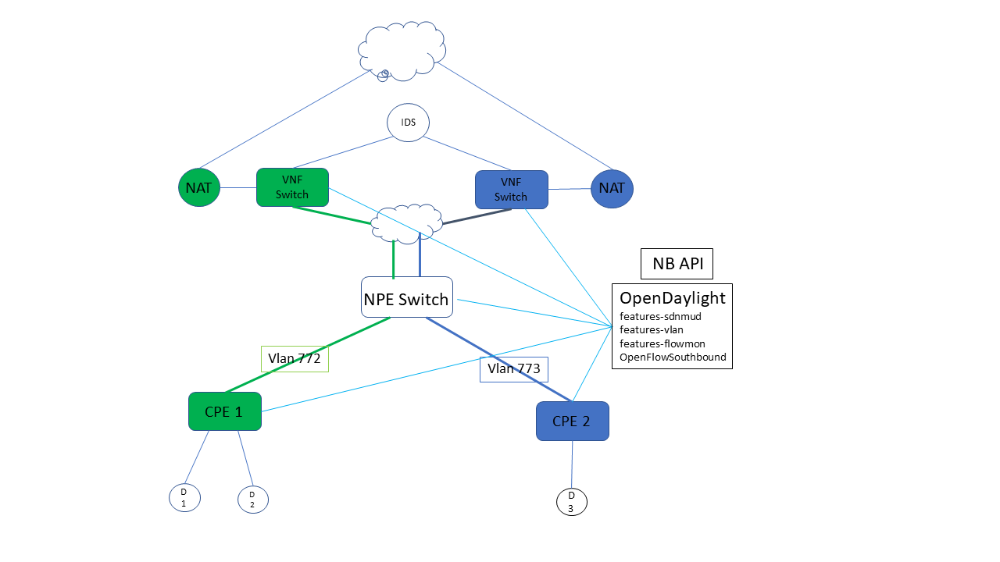
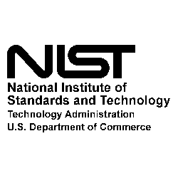

This repository publishes a scalable implementation of the IETF MUD standard. 

The MUD standard specifies access controls for IOT devices. IOT devices
are special purpose devices that implement a dedicated function.
Such devices have communication patterns that are known a-priori.
The goal of MUD is to provide a means for manufacturers of Things to
indicate what sort of access and network functionality they require
for the Thing to properly function.  A manufacturer associates an MUD
file with a device - which is a specialized ACL file where the ACLs
are specified to within deployment specific parameters. The MUD file is
converted to ACLs which are deployed on the access point when the IOT
device connects to the network.  The network infrastructure installs
Access Control Rules at access points to restrict what the device can
do on the network. In this project, MUD is implemented on SDN capable
switches using OpenDaylight as the SDN controller.

[The MUD standard is defined here](https://www.ietf.org/id/draft-ietf-opsawg-mud-18.txt)

This project implements the following :

- SDN-MUD : implements MUD ACLs on SDN Switches. Note that this is not a full ACL implementation. 
  We only implement the necessary ACLs to implement the profiles generated from mudmaker.org.

- Flow Monitor : A means for extracting outbound packets from IOT devices based on manufacturer 
(or unclassified packets) to be provided to an IDS such as Snort.

- VLAN Manager : VLAN tag management for switches. Each CPE switch is assigned a unique VLAN tag.
Packets outbound from the CPE switch on the uplink interface are tagged with the 
VLAN tag. These packets are routed to the appropriate VNF router in the service
provider network.

## Network Architecture ##

Our  network model consists of a collection of CPE switches connected
to an NPE switch. The NPE switch routes packets to a cloud-resident
virtual network function VNF switch. MUD flow rules are installed only
at CPE switches.  Packets that leave the CPE switch and are sent to the
NPE switch are tagged with a VLAN tag that identifies the CPE switch
from which they originated.  At the NPE switch the VLAN tag is used to
direct packets to a corresponding VNF switch. This arrangement extends
the CPE VLAN to the service provider cloud.

The following diagram shows the network architecture of the system.

MUD-specifc flow rules are installed on the CPE switches.

The NPE switch acts as a Multiplexer to forward packets from several CPE switches to its uplink interface towards the Cloud where 
Virtual network functions for the CPE reside.  

The flow monitoring facility allows an IDS to indicate interest in specific classes of packets i.e:
- Packets that have hit a MUD flow rule and successfully been fowarded to the Network provider.
- Packets that have no MUD rule associated with it and that are forwarded to the Network provider.

## Software Components ##

OpenDaylight is used as the SDN controller. The following Karaf features in opendaylight implement the features above:
This project consists of the following features:

* features-sdnmud is the scalable MUD implementation.  This application manages the mud-specific flow rules on the CPE switches.
This component can be used independently of the others.
* features-vlan this application installs flow rules on both the CPE switch and the NPE switch.
Packets sent from the IOT devices on the CPE switch are assigned a CPE-specific VLAN tag when they are sent to the uplink interface.
Packets sent to the CPE switch via the Uplink interface have their VLAN tags stripped for consumption by the devices attached to the switch.
It installs rules on the NPE switch to multiplex traffic based on the VLAN tag to the uplink interface.
* features-flowmon installs flow rules on the VNF switch. It installs rules to mirror a subset of the traffic that appears 
on the VNF switch onto a port from which an IDS can read and analyze the traffic. The packets of interest can be selected
by manufacturer. 

## Building ##

On the Controller host:

* Install JDK 1.8x and maven 3.5 or above.
* Install maven 3.5 or higher.
* Eclipse -- highly recommended if you want to look at code.

Copy maven/settings.xml to ~/.m2

Run maven
      mvn -e clean install -nsu -Dcheckstyle.skip -DskipTests -Dmaven.javadoc.skip=true

This will download the necessary dependencies and build the subprojects. Note that we have disabled 
unit tests and javadoc creation. This will change after the project is in a final state.

## Try it out  ##

[See the instructions in the test/demo directory](test/demo/README.md)

## Tests ##

[See the instructions in the test/unittest directory](test/unittest/README.md)

## LIMITATIONS ##

This is an IPV4 only implementation of MUD.  

This code is shared for early review. It is an implementation of an IETF
draft in progress. Much more testing and validation is required. Your help is 
solicited and will be acknowledged on this page.

Please do not re-distribute until this repository is granted public access.
This will happen after:

1. The IETF draft has achieved an RFC status.
2. All issues are satisfactorily resolved.

This project only implements the necessary ACL support for MUD profiles generated from MudMaker.org.
This limitation will be removed in subsequent releases as the MUD standard matures and gets deployed.

The vlan management code is for testing purposes. The OpenDaylight network virtualization NetVirt project
should be used for network virtualization.

## Copyrights and Disclaimers ##

The following disclaimer applies to all code that was written by employees
of the National Institute of Standards and Technology.

This software was developed by employees of the National Institute of
Standards and Technology (NIST), and others. This software has been
contributed to the public domain. Pursuant to title 15 Untied States
Code Section 105, works of NIST employees are not subject to copyright
protection in the United States and are considered to be in the public
domain. As a result, a formal license is not needed to use this software.

This software is provided "AS IS." NIST MAKES NO WARRANTY OF ANY KIND,
EXPRESS, IMPLIED OR STATUTORY, INCLUDING, WITHOUT LIMITATION, THE
IMPLIED WARRANTY OF MERCHANTABILITY, FITNESS FOR A PARTICULAR PURPOSE,
NON-INFRINGEMENT AND DATA ACCURACY. NIST does not warrant or make any
representations regarding the use of the software or the results thereof,
including but not limited to the correctness, accuracy, reliability or
usefulness of this software.

Specific copyrights for code that has been re-used from other open 
source projects are noted in the source files as appropriate.

## Credits ##

* The MUD Standard was primarily authored by Eliot Lear (Cisco) in the IETF OPSAWG working group.
* Lead designer / developer for this project : M. Ranganathan <mranga@nist.gov>
* Design Contributors : Charif Mohammed, Doug Montgomery
* Project Manager Doug Montgomery <dougm@nist.gov>
* This is a product of the Advanced Networking Technologies Division of the National Institute of Standards and Technology (NIST).
Please acknowledge our work if you re-use this code or design.

