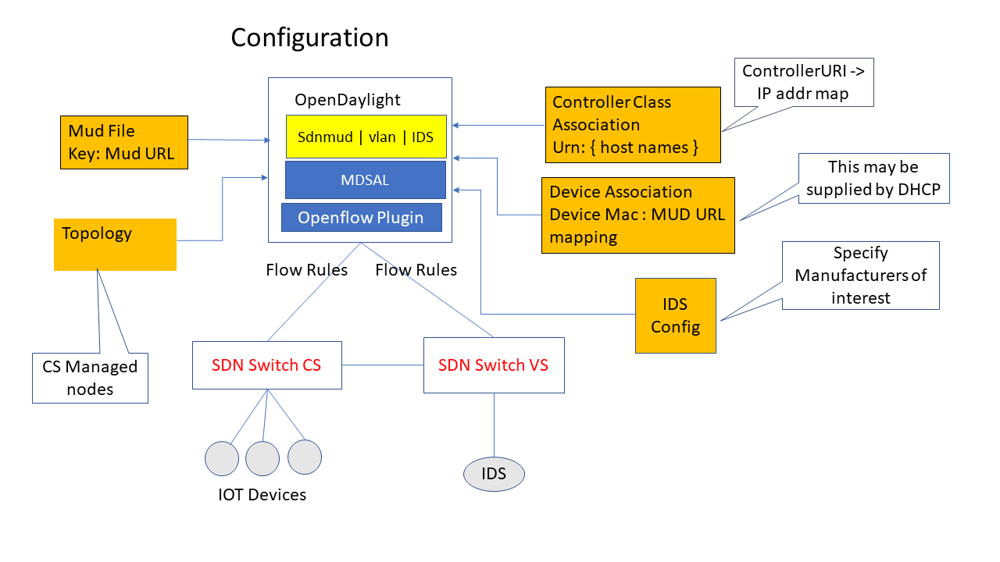
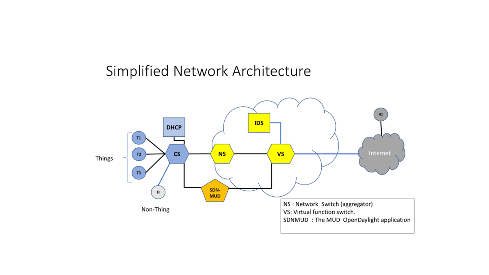
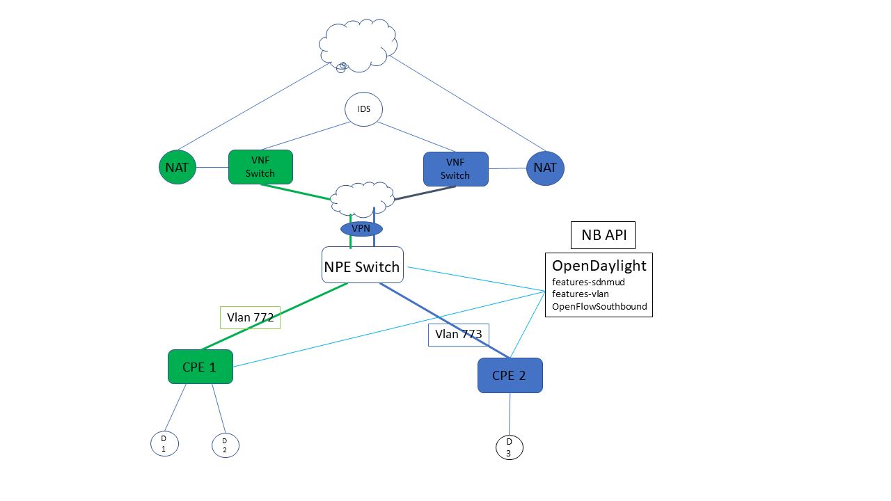

IOT devices are special purpose devices that implement a dedicated function.
Such devices have communication patterns that are known a-priori to the manufacturer.

The goal of MUD (Manufacturer Usage Description) is to provide a
means for manufacturers of Things to indicate what sort of access and
network functionality they require for the Thing to properly function.
A manufacturer associates a MUD file with a device which specifies an
ACL for the device to within deployment specific parameters.

[The MUD standard is defined here](https://www.ietf.org/id/draft-ietf-opsawg-mud-25.txt)

This repository publishes a public domain scalable implementation of
the  IETF MUD standard.  MUD is implemented on SDN capable switches
using OpenDaylight as the SDN controller.

## Deployment Assumptions ##

The assumed deployment scenario is an enterprise network. There are several
(CPE) switches that are assigned to departments. These are managed centrally.
The central office (IT shop) provides a VNF platform such as OpenStack which
can host Virtual Network functions.

This project implements the following functions :

- SDN-MUD : implements MUD ACLs on SDN Switches.
  Note that this is not a full ACL implementation.  We only implement the
  necessary ACLs to implement the MUD profiles as described in the RFC.
- VLAN Manager : VLAN tag management for switches. Each CPE switch is assigned a unique VLAN tag.
  Packets outbound from the CPE switch on the uplink interface are tagged with the 
  VLAN tag. These packets are routed to the appropriate VNF router in the OpenStack cloud.

## Implementation architecture ##

The following diagram shows the implementation architecture on OpenDaylight

## Integration with cloud resident IDS ##

The following diagrams shows the network architecture of the system.

The NPE switch routes packets to a cloud-resident virtual network
function VNF switch. MUD flow rules are installed only at CPE switches.
Packets that leave the CPE switch and are sent to the NPE switch are
tagged with a VLAN tag at the CPE switch that identifies the CPE switch
from which they originated.  At the NPE switch the VLAN tag is used to
direct packets to a corresponding VNF switch. This arrangement extends the
CPE (department) LAN to the enterprise cloud. We propose to host scalable
Intrusion Detection platforms in the enterprise cloud to complement the
functionality of MUD.

The NPE switch acts as a Multiplexer to forward packets from several CPE switches to its uplink interface towards the Cloud where 
Virtual network functions for the CPE reside. The uplink is provided via VPN encapsulation. 

## OpendDaylight Components ##

OpenDaylight is used as the SDN controller. The following Karaf features in OpenDaylight implement the features above:
This project consists of the following features:

* features-sdnmud is the scalable MUD implementation.  This application manages the mud-specific flow rules on the CPE switches.
This component can be used independently of the others.
* features-vlan this application installs flow rules on both the CPE switch and the NPE switch.
Packets sent from the IOT devices on the CPE switch are assigned a CPE-specific VLAN tag when they are sent to the uplink interface.
Packets sent to the CPE switch via the Uplink interface have their VLAN tags stripped for consumption by the devices attached to the switch.
It installs rules on the NPE switch to multiplex traffic based on the VLAN tag to the uplink interface.

## Building ##

On the Controller host:

* Install JDK 1.8x and maven 3.5 or above.
* Install maven 3.5 or higher.
* Eclipse -- highly recommended if you want to look at code.

Copy maven/settings.xml to ~/.m2

Run maven
      mvn -e clean install -nsu -Dcheckstyle.skip -DskipTests -Dmaven.javadoc.skip=true

This will download the necessary dependencies and build the subprojects. Note that we have disabled 
unit tests and javadoc creation. This will change after the project is in a final state.

## Try it out  ##

The following is common configuration for Demo and Test. The following describes
how to exercise the MUD feature.

#### Configure the emulation VM ####

In order for DNS to work on mininet hosts you should not be using local caching. 
Edit /etc/NetworkManager/NetworkManager.conf and comment out. 
We will start our own dnsmasq for testing.

        #dns=dnsmasq

Edit /etc/dnsmasq.conf. 

        no-hosts
        addn-hosts=/etc/dnsmasq.hosts
        dhcp-range=10.0.0.1,10.0.0.10,72h
        dhcp-host=00:00:00:00:00:01,10.0.0.1
        dhcp-host=00:00:00:00:00:02,10.0.0.2
        dhcp-host=00:00:00:00:00:03,10.0.0.3

Add a fake hosts in /etc/dnsmasq.hosts by adding the following lines:

      203.0.113.13    www.nist.local
      203.0.113.14    www.antd.local
      203.0.113.15    printer.nist.local

Kill any existing instance of dnsmasq on the emulation VM. We will
restart it in the test script.

      sudo pkill dnsmasq

If dnsmasq is running as a service, perform the following.
      
      sudo sed -i 's/^dns=dnsmasq/#&/' /etc/NetworkManager/NetworkManager.conf
      sudo service network-manager restart
      sudo service networking restart
      sudo killall dnsmasq

Add the following line to /etc/resolv.conf on the emulation VM.
 
      nameserver 10.0.0.5

### Configure the SDN Controller (OpenDaylight)  Host ###

Add the following to /etc/hosts on your controller host so that the java library can look up our fake hosts.

      203.0.113.13   www.nist.local
      203.0.113.14   www.antd.local
      203.0.113.15   printer.nist.local
      127.0.0.1      toaster.nist.local

### DEMO ###

[See the instructions in the test/demo directory](test/demo/README.md)

### Tests ###

[See the instructions in the test/unittest directory](test/unittest/README.md)

## LIMITATIONS and CAVEATS ##

This is BETA code. It has been lightly tested. Much more testing and validation is needed.

This is an IPV4 only implementation of MUD.  

X.509 extensions for MUD are not implemented.

LLDP extensions for MUD support are not implemented.

Only MANUFACTURER ACLs for MUD are implemented. MODEL ACL's are not implemented.

This is not a general ACL implementation.

This is experimental code. Much more testing is needed 
before it can be deployed in a production network. The 
authors solicit your help in testing and validation.

This code is shared for early review. It is an implementation of an IETF
draft in progress. 

## Copyrights and Disclaimers ##

The following disclaimer applies to all code that was written by employees
of the National Institute of Standards and Technology.

This software was developed by employees of the National Institute of
Standards and Technology (NIST), and others. This software has been
contributed to the public domain. Pursuant to title 15 Untied States
Code Section 105, works of NIST employees are not subject to copyright
protection in the United States and are considered to be in the public
domain. As a result, a formal license is not needed to use this software.

This software is provided "AS IS." NIST MAKES NO WARRANTY OF ANY KIND,
EXPRESS, IMPLIED OR STATUTORY, INCLUDING, WITHOUT LIMITATION, THE
IMPLIED WARRANTY OF MERCHANTABILITY, FITNESS FOR A PARTICULAR PURPOSE,
NON-INFRINGEMENT AND DATA ACCURACY. NIST does not warrant or make any
representations regarding the use of the software or the results thereof,
including but not limited to the correctness, accuracy, reliability or
usefulness of this software.

Specific copyrights for code that has been re-used from other open 
source projects are noted in the source files as appropriate.

## Credits ##

* The MUD Standard was primarily authored by Eliot Lear (Cisco) in the IETF OPSAWG working group.
* Lead designer / developer for this project : M. Ranganathan <mranga@nist.gov>
* Implementation Design Contributors : Charif Mohammed, Doug Montgomery
* Testing : Omar Ilias Elmimouni
* Project Manager Doug Montgomery <dougm@nist.gov>
* This is a product of the Advanced Networking Technologies Division of the National Institute of Standards and Technology (NIST).
* This work was funded using a Bridge to The Future (BTF) grant at NIST.

Please acknowledge our work if you re-use this code or design.

